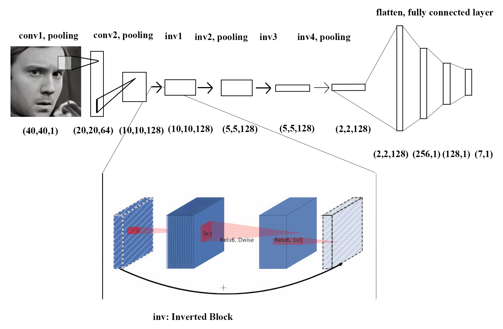
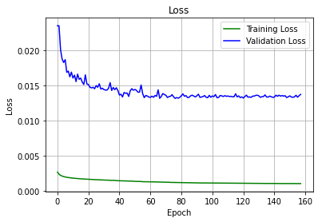
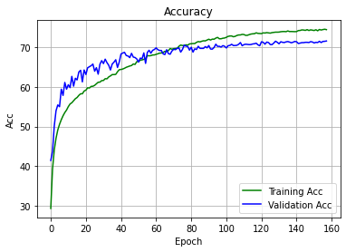
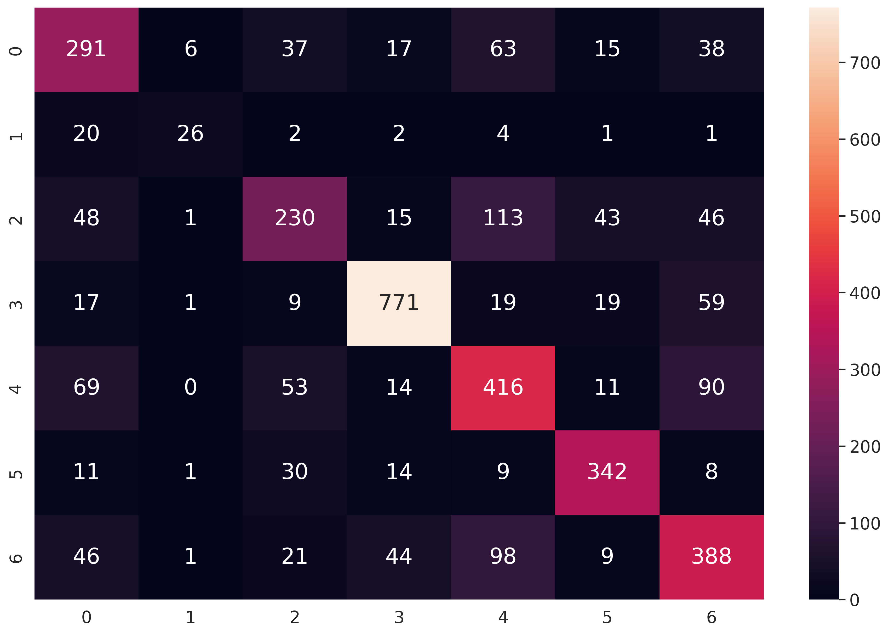

# Realtime facial emotion recognition model
A small CNN model to recognize facial emotion realtime, the model can run without support from GPU with approximately 10 fps.

### Overview
Facial emotion plays an important role in communication to present the all the meanings, attitudes want to transmit. Besides, facial emotion recognition is also bring other interesting benefits so it becomes getting more and more attention nowadays. Therefore, we propose a small CNN model can run on devices with or without GPU.
This project references the project [FER using VGGnet](https://github.com/usef-kh/fer)
Our model got **71.63 %** accuracy on public test and got **68.52 %** accuracy on private test set.

### Dataset
Here we use Facial Emotion Recognition 2013 (FER2013) to train our model, you can find more information in `dataset/fer2013/readme.txt`

### Mini-Fer model
You can see the model's architecture in image below:
:------------------------------------------------------:


### Training
To install the required packages, run `pip install -r requirements.txt`.
After that, you can run the code below to train the model:
```
python train.py network=fer_mini name=my-fer-mini
```
Losses           |  Accs
:-------------------------:|:-------------------------:
  |  

Confusion Matrix


### Demo
You can go to `demo/` and use `demo.ipynb` run on colab or use the code below:
```
python demo.py
```


